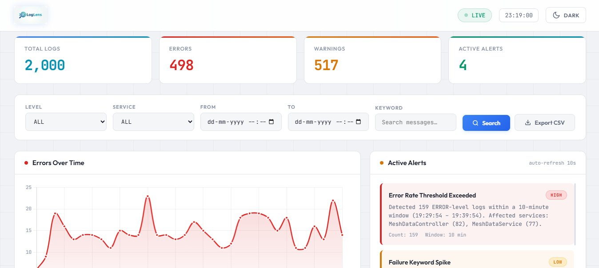

# LogLens — Log Monitoring & Alerting System

A real-time log monitoring dashboard built with FastAPI, Pandas, and Chart.js. Ingests application logs, provides search and filtering, detects abnormal patterns using intelligent alert rules, and displays everything in a live-updating dashboard.



## How to Run

```bash
# 1. Clone the repo
git clone https://github.com/Puneeth-RV/log-monitor-NT.git
cd log-monitor-NT

# 2. Install dependencies
pip install -r requirements.txt

# 3. Start the server
uvicorn main:app --reload

# 4. Open in browser
http://localhost:8000
```

## Design Decisions

**Architecture:** We chose a modular design where each team member owns one file. All modules share a global Pandas DataFrame (`store.DF`) as the single source of truth. This allowed 5 people to work in parallel without merge conflicts.

**Real-Time Simulation:** Instead of loading all 2,000 logs at once, `store.py` ingests 200 logs every 2 seconds, simulating live log streaming. The dashboard auto-refreshes to show logs appearing in real time — stats grow, the chart builds, and alerts fire as data flows in.

**Module Communication:** All modules use `import store` and reference `store.DF` to always get the latest DataFrame. This ensures that as new logs are ingested, filters, alerts, charts, and risk scores all reflect the current data.

**Frontend:** Single-page dark-themed dashboard using vanilla HTML/CSS/JS (no frameworks) with Chart.js for visualization. Polls the API every 2 seconds to stay in sync with the backend.

## Alert Rules Implemented

### Rule 1 — High ERROR Rate
- **Trigger:** More than 5 ERROR logs in a 10-minute window
- **Severity:** HIGH if count > 10, otherwise LOW
- **Output:** Error count, time window, per-service breakdown

### Rule 2 — Keyword "failed" Spike
- **Trigger:** The keyword "failed" appears more than 3 times in the 10-minute window (case-insensitive)
- **Severity:** LOW
- **Output:** Keyword match count, time window, per-service breakdown

### Rule 3 — Cascading Failure Detection
- **Trigger:** An ERROR spike (≥3) in one service is immediately followed by a WARN spike (≥3) in the same service within a 2-minute sub-window
- **Severity:** CRITICAL
- **Output:** Service name, error count, warning count, timestamps, and explanation that errors may be triggering downstream warnings
- **Why:** This goes beyond simple counting — it detects patterns that suggest one failure is causing a chain reaction, similar to production monitoring tools

## Bonus Features Implemented

- **Error Count Over Time Chart** — Line chart (Chart.js) showing errors per minute, updates with filters
- **Alert Severity Levels** — LOW, HIGH, and CRITICAL with color-coded badges
- **Live Log Polling** — Backend reloads logs every 2 seconds, frontend polls every 2 seconds
- **Export Filtered Logs to CSV** — Download filtered results as `filtered_logs.csv`
- **Service Risk Scores** — Each service scored 0–100 based on error ratio, warning ratio, "failed" keyword frequency, and log volume. Displayed with animated ring gauges

## API Endpoints

| Endpoint | Method | Description |
|----------|--------|-------------|
| `/` | GET | Serve the dashboard UI |
| `/logs` | GET | Filtered logs (params: level, service, from_time, to_time, keyword) |
| `/alerts` | GET | Active alerts with reasons and stats |
| `/chart` | GET | Error counts by minute (supports filter params) |
| `/risk` | GET | Per-service risk scores (0–100) |
| `/export` | GET | Download filtered logs as CSV |

## Tech Stack

- **Backend:** Python, FastAPI, Pandas, APScheduler
- **Frontend:** HTML, CSS, JavaScript, Chart.js
- **Data:** Regex-based log parsing into Pandas DataFrame

## Project Structure

```
log-monitor-NT/
├── store.py              ← Log ingestion (real-time simulation)
├── filters.py            ← Search & filter engine
├── alert_engine.py       ← Alert rules (3 rules including cascading detection)
├── chart_engine.py       ← Error-over-time chart data
├── risk_engine.py        ← Per-service risk scoring
├── main.py               ← FastAPI app connecting all modules
├── requirements.txt      ← Dependencies
├── sample-application.log← Input log file (2000 Spring Boot logs)
└── static/
    ├── index.html        ← Dashboard HTML
    ├── styles.css        ← Dark theme styling
    └── script.js         ← Frontend logic & polling
```